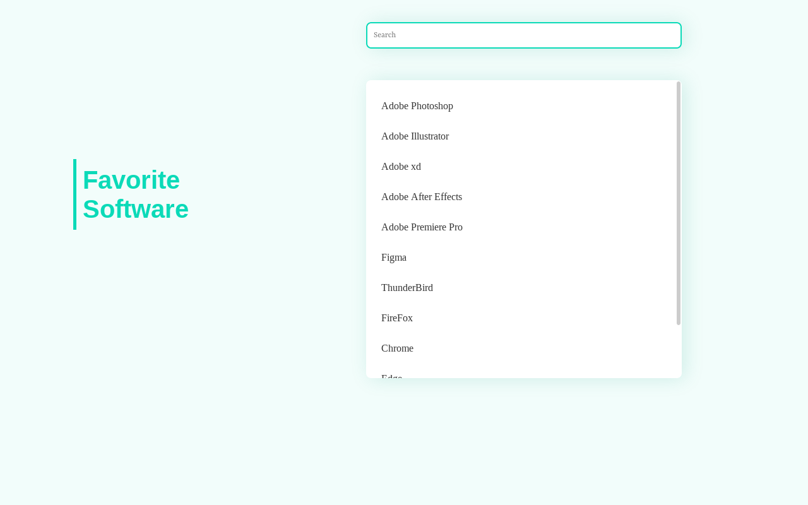
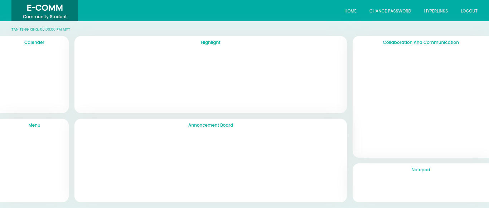
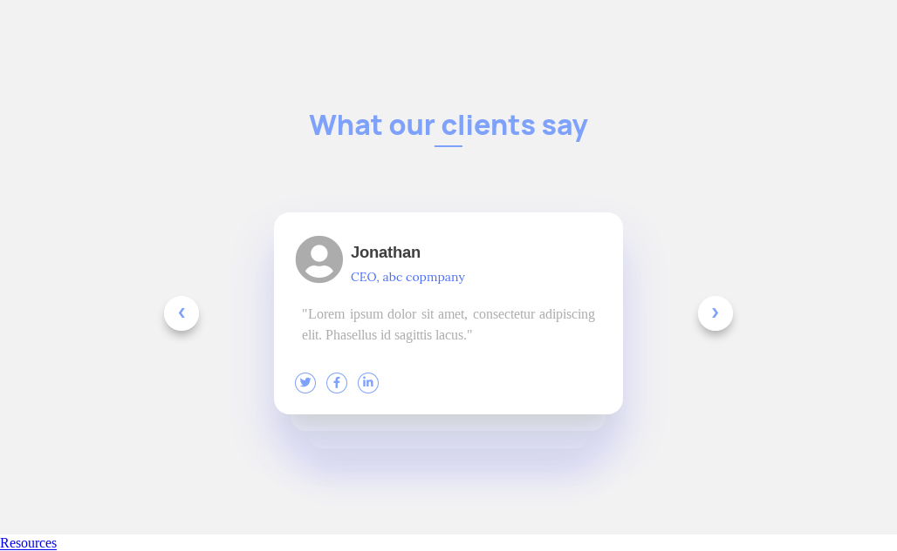

# webDesign_html

Some personal `HTML` and `CSS` practices.

1. **Subscribe Newsletter**

[](https://seventan1234.github.io/webDesign_html/web/subscribeNewsletter.html)

2. **Dropdown**

[](https://seventan1234.github.io/webDesign_html/web/dropdown.html)

3. **Contact Form**

[](web/contactUsForm.html)

4. **Student Community Home Page**
[](web/communityStudentHomePage.html)

5. **Testimonials**

[](web/testimonials.html)

## References

I am building web page in HTML by referring design of a YouTube channel called "DesignSense". 

These are references for me:

- [DesignSense - YouTube channel](https://www.youtube.com/channel/UCK3KESgQlmEBJ5DnRxWJ9oA)
- [Color Theory - YouTube video](https://youtu.be/_2LLXnUdUIc)
- [HTML & CSS - freeCodeCamp](https://www.youtube.com/channel/UCK3KESgQlmEBJ5DnRxWJ9oA)

---

## Favourite Fonts

Apply to CSS

*Lora* - 400, 700 

```css
@import url('https://fonts.googleapis.com/css2?family=Lora:wght@400;700&display=swap');
```

*Poppins* - 200, 500, 700 

```css
@import url('https://fonts.googleapis.com/css2?family=Poppins:wght@200;500;700&display=swap');
```

*Manrope* - 800 - **Big Title**

````css
 @import url('https://fonts.googleapis.com/css2?family=Manrope:wght@800&display=swap');
````

*JetBrains Mono* - 400 - **Button**

```css
 @import url('https://fonts.googleapis.com/css2?family=JetBrains+Mono&display=swap');
```

